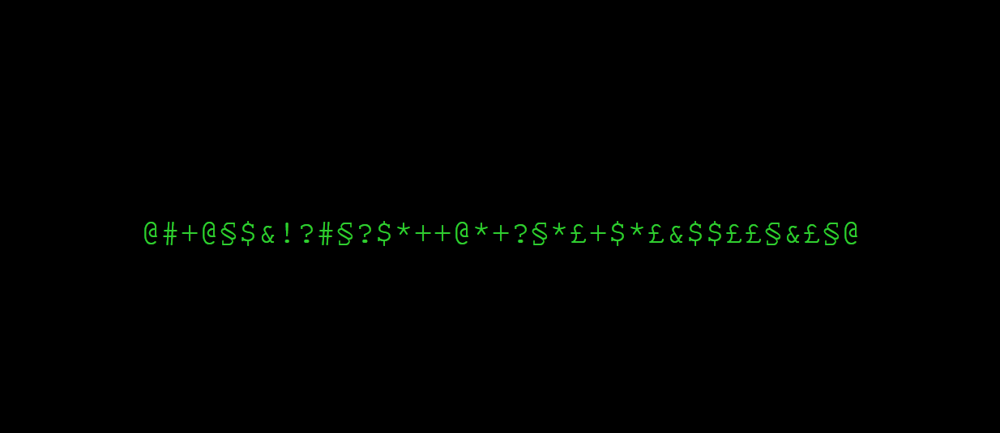

# Hacked-Text
A simple javascript library for showing text like a 90' hacker film


## How to use
Import the library and use the Init(ID_OF_TEXT_DOM, ITERATIONS, SPEED) where:
- ID_OF_TEXT_DOM = is the dom element with the innerText to "hack"
- ITERATIONS = number of iterations before decoding text
- SPEED = speed in ms for each iteration

...and you are ready to go!


example:

<index.html>
```
 <script src="hackerText.js"></script>
```

```
...
<body>
    <div id="text">
            Mess with the best, die like the rest
    </div>

    <script>Init("text", 5, 10)</script>
</body>
...

```

Live example:
https://lukeiszed.github.io/hacked-text/index.html


Hack the planet!

Created by:
LukeIsZed -_- Luca Bottazzi
